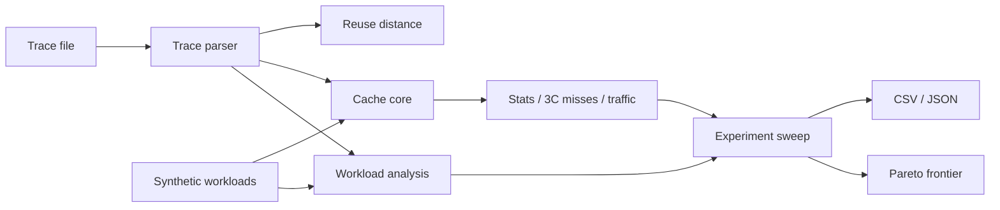

<div align="center">
  

  [](https://github.com/shiv814/cachecraft-simulator/actions/workflows/build.yml)
  
  
  

  **A C++17 cache-architecture simulator and experiment toolkit for studying locality, replacement/write policy, miss behavior, AMAT, memory traffic, reuse distance, and configuration trade-offs.**
</div>

---

## From simulator to experiment platform

CacheCraft began as a small set-associative cache simulator. Version 3 turns it into a more complete **computer-architecture experimentation environment**: the original cache core remains, while new modules characterize workloads, generate deterministic traces, analyze reuse distance, sweep many cache configurations, and identify Pareto-efficient designs.

The goal is not to imitate a cycle-accurate commercial simulator. The goal is to make cache behavior **observable, reproducible, and explainable**.

## Capability map

| Area | Capabilities |
|---|---|
| Organization | arbitrary capacity, power-of-two blocks, direct-mapped through fully associative |
| Replacement | LRU, FIFO and deterministic random |
| Writes | write-back/write-through and write-allocate/no-write-allocate |
| Accesses | read, write and instruction traces; multi-block records |
| Misses | compulsory, conflict and capacity classification using a shadow fully-associative cache |
| Traffic | dirty lines, writebacks, memory reads/writes and bytes fetched |
| Timing | hit latency, miss penalty and AMAT |
| Hierarchy | two-level L1/L2 simulation |
| Workloads | trace parser plus sequential, strided and seeded hot-set generators |
| Analysis | unique blocks, access mix, sequential fraction, average stride and reuse-distance distribution |
| Experiments | configuration sweeps, CSV/JSON output and capacity/miss/traffic Pareto frontier |
| Verification | Debug + Release builds on Linux, Windows and macOS |

## Architecture



## Quick start

```bash
git clone https://github.com/shiv814/cachecraft-simulator.git
cd cachecraft-simulator
cmake -S . -B build -DCMAKE_BUILD_TYPE=Release
cmake --build build --config Release
ctest --test-dir build -C Release --output-on-failure
```

Run the original CLI against `examples/sample.trace`, or run the v3 experiment program:

```bash
./build/cachecraft_experiments > experiments.csv
```

It creates a deterministic 10,000-access hot-set workload, summarizes its locality, sweeps multiple capacities/associativities, emits experiment data, and reports how many measured configurations remain on the Pareto frontier.

## Workload characterization

`WorkloadSummary` measures record count, expanded block accesses, read/write/instruction mix, unique blocks, sequential transitions and average absolute stride. This makes a trace explainable before interpreting cache results.

## Reuse-distance analysis

Reuse distance counts distinct blocks touched between two references to the same block. CacheCraft reports cold fraction plus average, median, p95 and maximum observed reuse distance. This gives a configuration-independent view of temporal locality.

## Controlled sweeps

```cpp
std::vector<CacheConfig> configs = /* capacities / ways / policies */;
auto results = cachecraft::sweep(trace, configs);
auto frontier = cachecraft::pareto_frontier(results);
std::cout << cachecraft::experiments_to_csv(results);
```

The Pareto comparison considers **capacity, miss rate, and memory transactions/access**. It does not hide engineering trade-offs behind a made-up weighted score.

## Repository map

```text
include/
  cache.hpp       cache/hierarchy public API
  trace.hpp       trace records and parser
  analysis.hpp    workload + experiment API
  reuse.hpp       reuse-distance API
  synthetic.hpp   deterministic workload generators
src/
  cache.cpp       cache behavior
  trace.cpp       input parsing
  main.cpp        interactive/CLI simulator
  analysis.cpp    experiment execution + Pareto selection
  reuse.cpp       locality analysis
  synthetic.cpp   synthetic workloads
  experiment.cpp  reproducible v3 experiment executable
tests/            cache correctness + v3 analysis tests
docs/             architecture, experiment methodology and trade-offs
```

## Engineering details worth discussing

- a fully-associative shadow cache separates conflict from capacity misses
- seeded random replacement/workloads preserve reproducibility
- write behavior tracks both cache state and backing-memory traffic
- experiment code reuses the public cache API instead of duplicating simulator logic
- multi-dimensional Pareto selection makes hardware-cost/performance trade-offs explicit
- cross-platform CI tests both Debug and Release to catch configuration-sensitive problems

## Documentation

- [Architecture](docs/ARCHITECTURE.md)
- [Experiment methodology](docs/EXPERIMENTS.md)
- [Engineering notes / model scope](docs/ENGINEERING.md)
- [Contributing](CONTRIBUTING.md)

## Scope

CacheCraft is an educational/portfolio memory-system model. It is not cycle-accurate and does not model coherence, prefetching, out-of-order execution, DRAM timing, physical area or power unless explicitly added later.

## License
MIT © Shivam Patel
