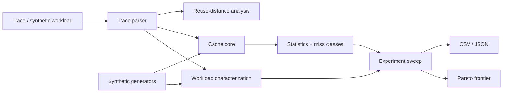

# CacheCraft Architecture

CacheCraft separates **cache mechanics** from **workload ingestion** and **experiment analysis**. That keeps the simulator useful both as a CLI and as a library for repeatable architecture studies.

## Cache core

The core owns address decomposition, set/way state, replacement, write/allocation policy, dirty lines, writebacks, memory traffic and 3C miss classification. It does not know how an experiment is presented.

## Analysis layer

`analysis.cpp` expands multi-block records consistently with the simulator, computes workload shape, runs configurations and derives comparable metrics such as miss rate, AMAT and memory traffic per access.

## Reuse distance

`reuse.cpp` estimates stack/reuse distance by counting distinct blocks between successive references to the same block. The current implementation favors clarity over asymptotic optimality and is intended for teaching/medium traces; a production profiler would use a more advanced order-statistics structure.

## Pareto selection

A configuration is retained when no other measured configuration is no worse in capacity, miss rate and memory transactions per access while being strictly better in at least one dimension. This makes trade-offs visible instead of declaring one arbitrary scalar score “best.”
